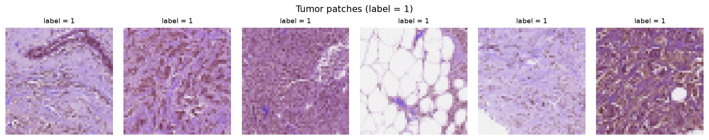
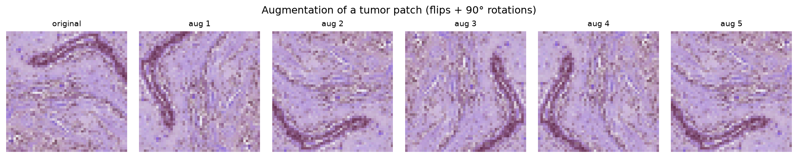

# ViT Fine-Tuning for Breast Histopathology Classification

     


Fine-tuning a Vision Transformer (ViT) for binary tumor / no-tumor classification of
breast histopathology image patches, built as a **reproducible, systematically-tuned
pipeline** following the principles of Google's *Deep Learning Tuning Playbook*.

---
### Sample tumor patches


### Augmentation


Training-time augmentation uses the dihedral symmetries (horizontal/vertical flips
and 90° rotations), valid because histopathology patches have no canonical
orientation. Validation and test use deterministic transforms only.


## Headline result


| Setting | Value |
|---|---|
| Model | `google/vit-base-patch16-224-in21k` (full fine-tune) |
| Best learning rate | ≈ 3.34e-5 |
| Warmup ratio | ≈ 0.006 |
| Weight decay | ≈ 5.5e-4 |
| Training horizon | 2000 steps (best checkpoint ≈ step 1500) |

**Final results** (best configuration, best checkpoint):

| Split | ROC-AUC | Brier score |
|---|---|---|
| Validation (2k) | 0.9527 | 0.0816 |
| **Test (2k, held out)** | **0.9615** | **0.0698** |

> The **test** set was untouched during all tuning, so its test ROC-AUC (0.9615) is an
> unbiased estimate. Test metrics slightly *exceed* validation metrics, indicating the
> tuning did not overfit to the validation set and the model generalizes well.

---

## Aims and Objectives

Most first image-classification projects are a single notebook that trains a model and
prints an accuracy. This project instead applies a **structured tuning methodology** and
**production-style engineering** to a real medical-imaging task:

- Hyperparameters are explicitly sorted into **scientific / nuisance / fixed** roles.
- Training length is a **fixed step horizon** (identical across trials) rather than an
  epoch count, so trials are directly comparable.
- The best model is chosen by **retrospective checkpoint selection** (best validation
  metric), not the final epoch.
- The **test set is held out** and untouched during tuning, for an unbiased final estimate.
- Hyperparameter search uses **quasi-random search** (the exploration-phase method the
  Tuning Playbook recommends).

---

## Methodology

The tuning was run as **two sequential studies**, each with a distinct scientific question.

### Study 1 — Freeze vs. full fine-tune
- **Scientific parameter:** `freeze_backbone`.
- **Finding:** full fine-tuning (≈ 0.95 val AUC) decisively outperformed head-only /
  frozen-backbone training (≈ 0.80 val AUC) for this domain, where ImageNet-pretrained
  features must adapt to tissue imagery.
- *Caveat:* a fully controlled comparison would re-tune the learning rate within each
  condition (optimal LR differs for frozen vs. full fine-tune); the large observed gap
  suggests the conclusion is robust regardless.

### Study 2 — Learning-rate tuning (full fine-tune)
- **Scientific parameter:** learning rate.
- **Nuisance parameters** (co-tuned so the LR comparison is fair): warmup ratio,
  weight decay.
- **Fixed parameters:** batch size (32, throughput-limited), training horizon,
  optimizer (AdamW), model architecture, augmentation, seed, data-split sizes.
- **Search:** quasi-random (W&B Sweeps, `method: random`).
- **Finding:** best LR ≈ 3.3e-5; very low LRs (≈ 1e-6) clearly underperformed
  (val AUC ≈ 0.91), locating the useful LR region for this problem.

### Evaluation
- **ROC-AUC** — discrimination (threshold-independent ranking quality).
- **Brier score** — probability quality / calibration
  (`mean((prob − label)^2)`).
- **Calibration** — reliability assessed via the **CORP** approach
  on the exported prediction CSVs, decomposing the Brier 
  score into miscalibration / resolution / uncertainty.

---

## Data

- **Dataset:** breast histopathology image patches (`dbzadnen/breast-histopathology-images`).
- **Splits (disjoint, from the dataset's native partitions, fixed seed):**
  - Train: 10,000
  - Validation: 2,000
  - Test: 2,000 (held out; touched only for the final evaluation)
- **Augmentation (train only):** horizontal + vertical flips and 90° rotations — the
  dihedral symmetries, valid because tissue patches have no canonical orientation.
  Validation and test use deterministic transforms only.

### Class balance (0/1) across splits

| Split | N | Label 0 (no tumor) | Label 1 (tumor) |
|---|---:|---:|---:|
| Train | 10,000 | 7,180 (71.8%) | 2,820 (28.2%) |
| Validation | 2,000 | 1,408 (70.4%) | 592 (29.6%) |
| Test | 2,000 | 1,415 (70.8%) | 585 (29.2%) |

The dataset is quite imbalanced (~71% negative / ~29% positive), with the ratio somewhat consistent across all three splits.
Accordingly, ROC-AUC and the Brier score are reported instead of accuracy, which a trivial majority-class predictor would reach at ~71%.

To reproduce the above numbers: `uv run python scripts/data_ratio_check.py`

---

## Tech stack

- **PyTorch** + **Hugging Face** `transformers` / `datasets` -- model and data
- **Hydra** -- configuration management (grouped configs, command-line overrides)
- **Weights & Biases** -- experiment tracking and hyperparameter sweeps
- **uv** -- dependency management and reproducible environments
- **R** (`reliabilitydiag`) -- calibration analysis (CORP)

---

## Project structure

```
vit-histopathology/
├── .github/
│   └── workflows/
│       └── ci.yml                    # cross-platform CI
├── conf/                             # Hydra configs
│   ├── config.yaml                   # root config
│   ├── model/
│   │   └── vit_base.yaml
│   ├── data/
│   │   └── pcam.yaml
│   ├── train/
│   │   └── default.yaml
│   └── study/
│       └── default.yaml
├── src/
│   └── vit_histo/                    # the package
│       ├── __init__.py
│       ├── data.py                   # dataloaders, splits, transforms
│       ├── model.py                  # ViT loading + freezing
│       ├── trainer.py                # training loop, checkpoint selection
│       ├── evaluate.py               # AUC + Brier metrics
│       ├── train.py                  # Hydra entry point
│       └── logging_setup.py
├── scripts/                          # standalone utilities (not part of the package)
│   ├── data_ratio_check.py           # class-balance verification
│   └── make_figures.py               # sample + augmentation figures
├── notebooks/                        # exploratory / sweep-driver notebooks
│   └── wandb_sweep.ipynb
├── tests/                            # unit tests (CI runs these)
│   ├── __init__.py
│   └── test_*.py
├── figures/                          # generated figures for the README
│   ├── label1_samples.png
│   └── augmentation_demo.png
├── README.md
├── pyproject.toml
├── uv.lock
├── LICENSE                         
└── .gitignore
```

---

## Usage

Install (via uv):

```bash
uv sync
```

Config / a basic validation (no GPU, no data needed):

```bash
uv run python -m vit_histo.train dry_run=true
```

Single training run:

```bash
uv run python -m vit_histo.train train.lr=3.34e-5 train.max_train_steps=2000
```

Final Phase-2 run (trains best config, evaluates on **both** val and test,
writes `val_predictions.csv` and `test_predictions.csv`):

```bash
uv run python -m vit_histo.train eval_on_test=true \
  train.lr=3.34e-5 train.warmup_ratio=0.006 \
  train.weight_decay=5.5e-4 train.max_train_steps=2000
```

Run the project's unit tests
```bash
uv run pytest tests/ -v
```

Hyperparameter sweep (W&B, quasi-random) is driven from the Colab notebook in
`notebooks/` — see that notebook for the sweep configuration and agent setup.

---

## Notes & possible extensions

- **Exploitation phase:** the sweep used quasi-random search (exploration). A reasonable
  next step is to employ Bayesian optimisation (W&B `method: bayes`) over a *narrowed* LR
  range around ≈ 3e-5, to efficiently extract the best final configuration.
- **Regularisation:** weight decay, augmentation, and checkpoint selection were used.
  Dropout was left at the pre-trained model's default; introducing and tuning it is a
  possible extension, motivated by the mild train/val gap observed late in training.
- **Data scale:** training used (`seed = 42`) a 10k subsample for compute reasons; the full dataset
  (~249k train images) is available, and training on more real data would likely reduce
  the need for augmentation.
- **Uncertainty:** with a 2k test set, reporting a confidence interval
- **Augmentation**
---

## Acknowledgements

This project builds on open-source models, data, and tooling:

- **Model:** [`google/vit-base-patch16-224-in21k`](https://huggingface.co/google/vit-base-patch16-224-in21k)
  — Vision Transformer pretrained on ImageNet-21k, via Hugging Face.
- **Dataset:** [`dbzadnen/breast-histopathology-images`](https://huggingface.co/datasets/dbzadnen/breast-histopathology-images)
  — breast histopathology image patches, via the Hugging Face Hub.
- **Libraries:** Hugging Face [`transformers`](https://github.com/huggingface/transformers)
  and [`datasets`](https://github.com/huggingface/datasets), [PyTorch](https://pytorch.org/),
  [Hydra](https://hydra.cc/), and [Weights & Biases](https://wandb.ai/).
- **Methodology:** Google's
  [Deep Learning Tuning Playbook](https://github.com/google-research/tuning_playbook).

The model and the dataset are subject to their own respective licenses;
this project's MIT license applies only to the code in this repository.